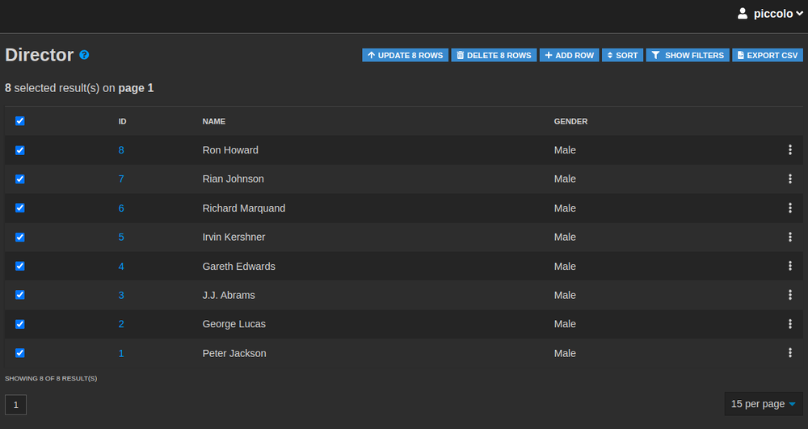

.. _Actions:

Actions
=======

Piccolo Admin allows us to perform bulk actions, by ticking the checkboxes
next to the rows.

Bulk delete
-----------

Ability to delete multiple rows in one action. Select which rows you
want to delete by checking the checkboxes and pressing the ``delete`` button.

Bulk update
-----------

Ability to update multiple rows in one action. Select which rows you
want to update by checking the checkboxes. By pressing the ``update``
button you will be asked to pass the column name and the value which you want
to update in bulk.

Export to CSV
-------------

Export data to a CSV document by pressing the ``export CSV`` button.
