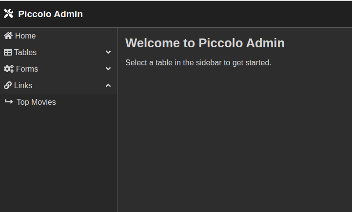

ASGI
====

Since the admin is an `ASGI app <https://piccolo-orm.com/blog/introduction-to-asgi/>`_,
you can either run it standalone like in the demo, or integrate it with a
larger ASGI app.

.. hint:: Piccolo can help you `create a new ASGI app <https://piccolo-orm.readthedocs.io/en/latest/piccolo/asgi/index.html>`_
   using ``piccolo asgi new``.

For example, using Starlette routes:

.. literalinclude:: ./examples/starlette/app.py

-------------------------------------------------------------------------------

FastAPI example
---------------

Here's a complete example of a FastAPI app using Piccolo admin.

.. literalinclude:: ./examples/fastapi/app.py

To run ``app.py`` use:

.. code-block:: bash

    uvicorn app:app --port 8000 --host 0.0.0.0

Now you can go to `<localhost:8000/admin>`_ and log in as an admin user
(see :ref:`Authentication` for how to create users).

-------------------------------------------------------------------------------

Sidebar links
-------------

We can specify custom links in the navigation sidebar. This feature is 
useful if we want to enable quick way to get specific pages with 
pre-applied filters/sorts.

Example code:

.. literalinclude:: ./examples/sidebar_links/app.py

-------------------------------------------------------------------------------

Source
------

.. currentmodule:: piccolo_admin.endpoints

.. autoclass:: create_admin
