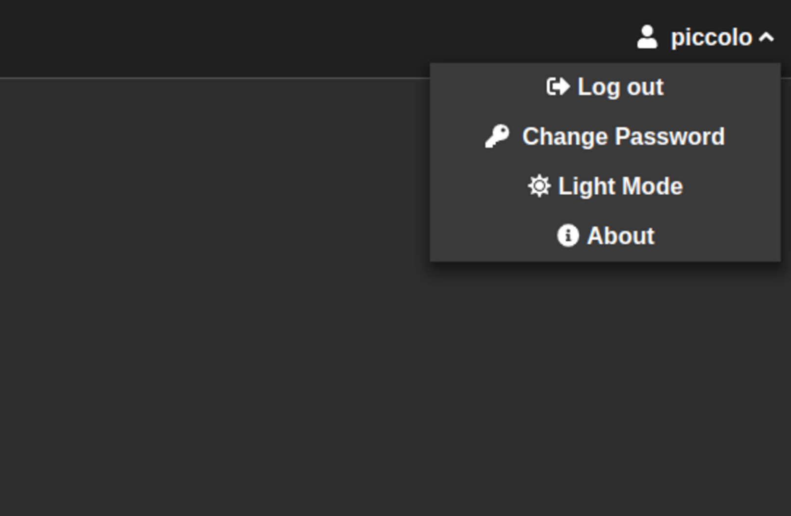
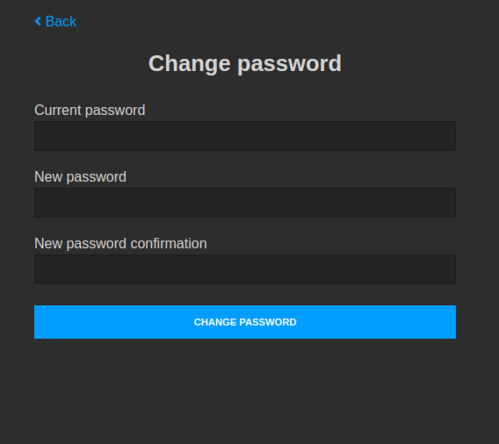

.. _Authentication:

Authentication
==============

Session table
-------------

Piccolo admin uses `session auth <https://piccolo-api.readthedocs.io/en/latest/session_auth/index.html>`_,
which requires a ``Session`` database table.

Add ``piccolo_admin.piccolo_app`` to the `APP_REGISTRY <https://piccolo-orm.readthedocs.io/en/latest/piccolo/projects_and_apps/piccolo_projects.html#app-registry>`_ in your ``piccolo_conf.py``
project file, then run migrations:

.. code-block:: bash

    piccolo migrations forwards session_auth

To learn more about the Piccolo project files, check out the
Piccolo ORM `docs <https://piccolo-orm.readthedocs.io/en/latest/piccolo/projects_and_apps/piccolo_apps.html>`_.

-------------------------------------------------------------------------------

Creating users
--------------

``BaseUser`` is a ``Table`` you can use to store and authenticate your users.
You need this table to be able to create users with admin privileges.
``BaseUser`` is shipped out of the box with Piccolo and you just need to run the migrations.

Run the migrations:

.. code-block:: bash

    piccolo migrations forwards user

Create a new user.

.. code-block:: bash

    piccolo user create

You will be prompted to enter a username, email address and password
(you will be asked to enter your password twice for confirmation).
Make sure you enter ``y`` when asked if it's an admin user, otherwise the user
won't be able to login to the Piccolo admin GUI.

.. warning::
    Non-admin users can't login to the Piccolo admin GUI.

You can also change a user's password:

.. code-block:: bash

    piccolo user change_password

-------------------------------------------------------------------------------

Change admin password in the UI
-------------------------------

The admin user also has the option to change their password in the Piccolo Admin UI.
This option can be selected from the user dropdown menu.

After that, you will be shown a form in which you can change your
administrator password.

