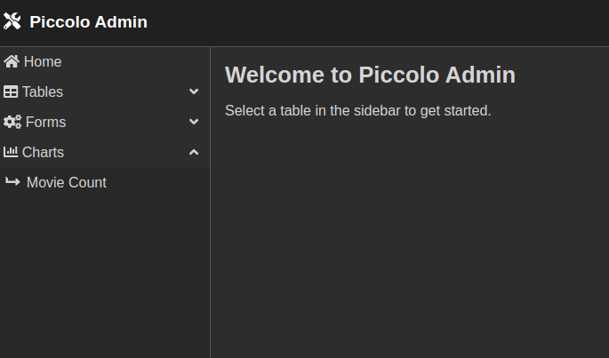
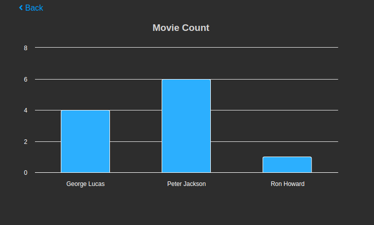

.. _Charts:

Charts
======

Piccolo Admin can display different types of charts based on yours
data. Five chart types are supported: ``Pie``, ``Line``, ``Column``, 
``Bar`` and ``Area``.

Here's an example of charts usage, using FastAPI:

.. literalinclude:: ./examples/app.py

Piccolo Admin will then show a charts in the UI.

.. warning::

  The data format must be a ``list of lists`` 
  (eg. ``[["Male", 7], ["Female", 3]]``).

-------------------------------------------------------------------------------

Source
------

.. currentmodule:: piccolo_admin.endpoints

.. autoclass:: ChartConfig
