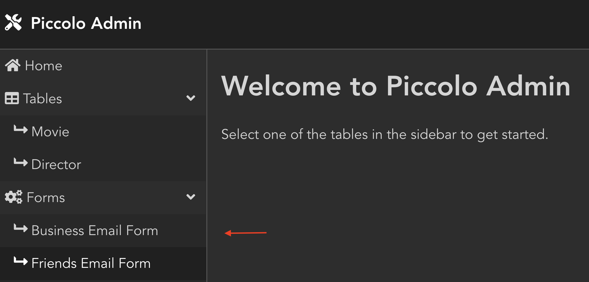
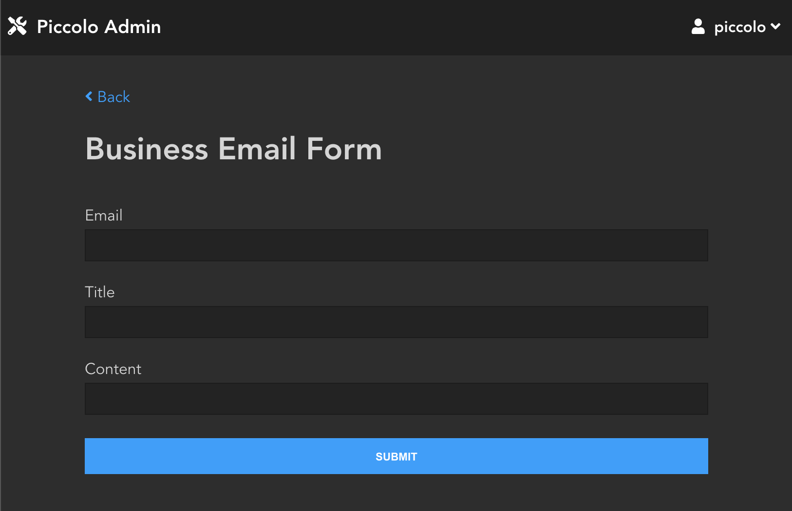

.. _CustomForms:

============
Custom Forms
============

Piccolo Admin lets you easily add custom forms, which can be useful for many
different purposes e.g. running tasks and downloading reports.

Here's an example booking form:

All that is required is a Pydantic model, and an endpoint, and Piccolo Admin
will generate all of the UI for you, without you having to write any frontend
code.

-------------------------------------------------------------------------------

Endpoint
========

The endpoint is a sync or async function that either returns a string, or a
``FileResponse``.

string
------

If a string is returned, it is shown to the user once the form has been
submitted.

Here's a really simple example:

.. literalinclude:: ../../../piccolo_admin/example/forms/calculator.py

Here's a more advanced example where we send an email, then return a string:

.. literalinclude:: ../../../piccolo_admin/example/forms/email.py

``FileResponse``
----------------

This allows you to return a file to the user - for example, an image or CSV file.

.. hint::
    This is intended for small to medium sized files only (i.e. no 1 GB video files!).
    We will add support for large files in the future.

CSV example
~~~~~~~~~~~

.. literalinclude:: ../../../piccolo_admin/example/forms/csv.py

Image example
~~~~~~~~~~~~~

.. literalinclude:: ../../../piccolo_admin/example/forms/image.py

-------------------------------------------------------------------------------

Full Example
============

Here's a full example of how to integrate a form with an ASGI framework like
FastAPI:

.. literalinclude:: ./examples/app.py

-------------------------------------------------------------------------------

Source
======

.. currentmodule:: piccolo_admin.endpoints

.. autoclass:: FormConfig

.. autoclass:: FileResponse
