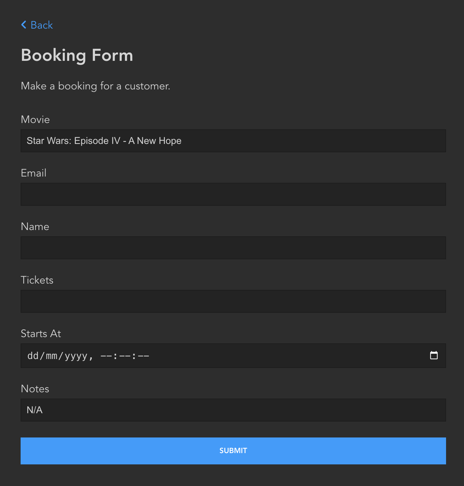

.. _CustomForms:

Custom Forms
============

Piccolo Admin has the ability to turn a Pydantic model into a form in the UI,
without writing any frontend code.

Here's an example of a form which sends email, using FastAPI:

.. literalinclude:: ./examples/app.py

Piccolo Admin will then show a custom form in the UI.

.. image:: ./images/forms_sidebar.png

To process the form, you only need to specify the Pydantic model and function
which processes your custom form and Piccolo Admin will do the rest, like in
the above example.

-------------------------------------------------------------------------------

Source
------

.. currentmodule:: piccolo_admin.endpoints

.. autoclass:: FormConfig
