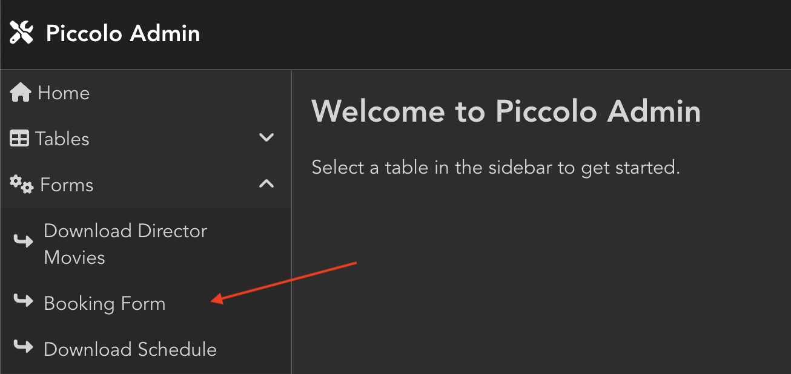

.. _CustomForms:

Custom Forms
============

Piccolo Admin has the ability to turn a Pydantic model into a form in the UI,
without writing any frontend code.

Here's an example of a form which sends email, using FastAPI:

.. code-block:: python

    import smtplib

    from fastapi import FastAPI
    from piccolo_admin.endpoints import (
        create_admin,
        FormConfig,
    )
    from pydantic import BaseModel

    from home.tables import Task

    # Pydantic model for form
    class EmailFormModel(BaseModel):
        email: str
        title: str
        content: str

    # Send email handler
    def email_endpoint(request, data):
        sender = "info@example.com"
        receivers = data.email

        message = f"""From: Sender <info@example.com>
        To: Receiver <{data.email}>
        Subject: {data.title}
        {data.content}
        """

        try:
            smtpObj = smtplib.SMTP("localhost:1025")
            smtpObj.sendmail(sender, receivers, message)
            print("Successfully sent email")
        except smtplib.SMTPException:
            print("Error: unable to send email")

        return "Email sent"

    app = FastAPI(
        routes=[
            Mount(
                "/admin/",
                create_admin(
                    tables=[Task],
                    forms=[
                        FormConfig(
                            name="Business Email Form",
                            pydantic_model=EmailFormModel,
                            endpoint=email_endpoint,
                        ),
                    ],
                ),
            ),
        ],
    )

    # For Starlette it is identical, just `app = Starlette(...)`

Piccolo Admin will then show a custom form in the UI.

.. image:: ./images/form.png

To process the form, you only need to specify the Pydantic model and function
which processes your custom form and Piccolo Admin will do the rest, like in
the above example.

-------------------------------------------------------------------------------

Source
------

.. currentmodule:: piccolo_admin.endpoints

.. autoclass:: FormConfig
