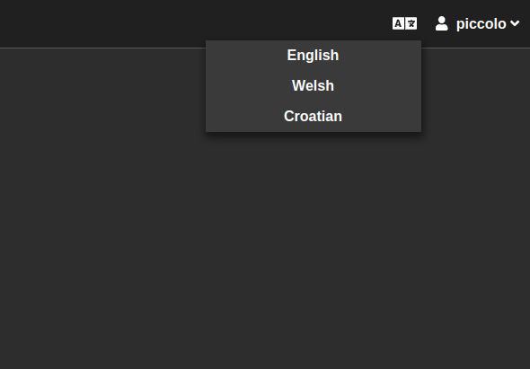

.. _Internationalization:

Internationalization
====================

Piccolo Admin has built-in language translations for easy internationalization.

By clicking on the icon in the menu, the user can change their language, and
UI will be translated accordingly.

Default language
----------------

By default, the user's language is detected from the web browser using the
``navigator.language`` JavaScript API.

You can explicitly set the default instead. For example, if we know all of our
users are French speakers, we can explicitly set French as the default.

.. code-block:: python

    admin = create_admin(..., default_language_code="fr")

Available languages
-------------------

To see all of the languages that we support, see
``piccolo_admin/translations/data.py``.

.. hint::
    More languages ​​will be supported in the future. Pull requests are welcome.

You can create your own translations using the
:class:`Translation <piccolo_admin.translations.models.Translation>` class.

By default, all of the languages we have translations for are made available in
the dropdown in the UI. However you can reduce the number of options, if you
know your users only require certain languages.

.. code-block:: python

    from piccolo_admin.translations.data import ENGLISH, FRENCH

    admin = create_admin(..., translations=[ENGLISH, FRENCH])

