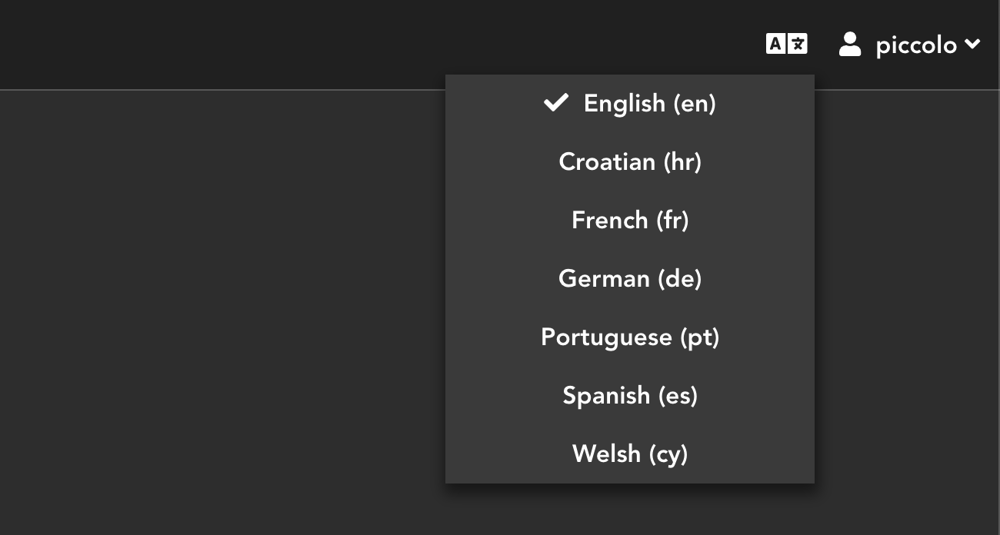

.. _Internationalization:

Internationalization
====================

Piccolo Admin has built-in language translations for easy internationalization.

Default language
----------------

You have the option to set the default language in the ``create_admin`` constructor.

.. code-block:: python

    admin = create_admin(..., default_language="welsh")

This is an optional feature. If you do not specify a ``default_language``,
the default value will be ``"english"``.

Usage
-----

From the language dropdown menu choose the language for which you want a translation. 

.. hint::
    More languages ​​will be supported in the future. Pull requests are welcome.
