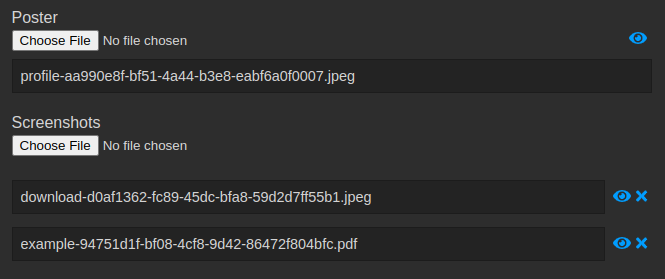

.. _MediaStorage:

Media Storage
=============

Piccolo Admin has excellent support for managing media files (images, audio,
video, and more). The files can be stored locally on the server, or in
S3 compatible storage.

User Interface
--------------

You're able to view many file types within the user interface - images, videos,
audio, documents, and more.

Viewing images:

Viewing video:

Viewing audio:

Viewing PDFs:

.. image:: ./images/sample_ui/media_viewer_pdf.png

Supported columns
-----------------

We store the files in a folder on the server, or in a S3 bucket, and store
unique references to those files in the database.

.. note::
    We don't store the files directly in the database, because database storage
    is typically much more expensive than block / object storage.

An example file reference is ``my-file-abc-123.jpeg``. Since it's a string, we
can only store it in a database column which stores strings.

Varchar
~~~~~~~

:class:`Varchar <piccolo.columns.column_types.Varchar>` is a good choice for
storing file references. For example:

.. code-block:: python

    from piccolo.table import Table
    from piccolo.column.column_types import Varchar

    class Movie(Table):
        poster = Varchar()

Text
~~~~

:class:`Text <piccolo.columns.column_types.Text>` can also be used. For
example:

.. code-block:: python

    from piccolo.table import Table
    from piccolo.column.column_types import Text

    class Movie(Table):
        poster = Text()

Array
~~~~~

We also support :class:`Array <piccolo.columns.column_types.Array>`, but only
when the ``base_column`` is either ``Varchar`` or ``Text``. For example:

.. code-block:: python

    from piccolo.table import Table
    from piccolo.column.column_types import Array, Varchar

    class Movie(Table):
        screenshots = Array(base_column=Varchar())

This allows us to store multiple file references in a single column.

MediaStorage
------------

For each column we want to use for media storage, we associate it with a
:class:`MediaStorage <piccolo_api.media.base.MediaStorage>` instance.

Out of the box we have two subclasses - :class:`LocalMediaStorage <piccolo_api.media.local.LocalMediaStorage>`
and :class:`S3MediaStorage <piccolo_api.media.s3.S3MediaStorage>`.
You can also create your own subclass of :class:`MediaStorage <piccolo_api.media.base.MediaStorage>`
to implement your own storage backend.

LocalMediaStorage
-----------------

This stores media in a folder on the server.

Example
~~~~~~~

In order to associate a column with ``LocalMediaStorage``, we do the following:

.. code-block:: python

    import os

    from piccolo.columns import Array, Varchar
    from piccolo_admin.endpoints import  (
        TableConfig,
        create_admin
    )
    from piccolo_api.media.local import LocalMediaStorage

    class Movie(Table):
        title = Varchar()
        poster = Varchar()
        screenshots = Array(base_column=Varchar())

    MEDIA_ROOT = '/srv/piccolo-admin/'

    MOVIE_POSTER_MEDIA = LocalMediaStorage(
        column=Movie.poster,
        media_path=os.path.join(MEDIA_ROOT, 'movie_poster'),
        allowed_extensions=['jpg', 'jpeg', 'png']
    )

    MOVIE_SCREENSHOTS_MEDIA = LocalMediaStorage(
        column=Movie.screenshots,
        media_path=os.path.join(MEDIA_ROOT, 'movie_screenshots'),
        allowed_extensions=['jpg', 'jpeg', 'png']
    )

    movie_config = TableConfig(
        table_class=Movie,
        media_storage=[MOVIE_POSTER_MEDIA, MOVIE_SCREENSHOTS_MEDIA],
    )

    APP = create_admin([movie_config])

Some things to be aware of:

* By specifiying ``allowed_extensions``, we make sure that only images can be
  uploaded.
* We store the files for posters and screenshots in **separate folders** - this
  is important when :ref:`cleaning up files <CleaningUpFiles>`.

Source
~~~~~~

.. currentmodule:: piccolo_api.media.local

.. autoclass:: LocalMediaStorage

S3MediaStorage
--------------

This allows us to store files in a private S3 bucket. When we need to access
a file, a signed URL is generated, so the file can be viewed securely.

Example
~~~~~~~

In order to associate a column with ``S3MediaStorage``, we do the following:

.. code-block:: python

    import os

    from piccolo.columns import Array, Varchar
    from piccolo_admin.endpoints import  (
        TableConfig,
        create_admin
    )
    from piccolo_api.media.s3 import S3MediaStorage

    class Movie(Table):
        title = Varchar()
        poster = Varchar()
        screenshots = Array(base_column=Varchar())

    # Note - don't store credentials in source code if possible.
    # It's safer to read them from environment variables.
    # A tool like `python-dotenv` can help with this.
    S3_CONNECTION_KWARGS = {
        "aws_access_key_id": os.environ.get("AWS_ACCESS_KEY_ID"),
        "aws_secret_access_key": os.environ.get("AWS_SECRET_ACCESS_KEY"),
    }

    MOVIE_POSTER_MEDIA = S3MediaStorage(
        column=Movie.poster,
        bucket_name="bucket123",
        folder_name="movie_poster",
        connection_kwargs=S3_CONNECTION_KWARGS,
        allowed_extensions=['jpg', 'jpeg', 'png']
    )

    MOVIE_SCREENSHOTS_MEDIA = S3MediaStorage(
        column=Movie.screenshots,
        bucket_name="bucket123",
        folder_name="movie_screenshots",
        connection_kwargs=S3_CONNECTION_KWARGS,
        allowed_extensions=['jpg', 'jpeg', 'png']
    )

    movie_config = TableConfig(
        table_class=Movie,
        media_storage=[MOVIE_POSTER_MEDIA, MOVIE_SCREENSHOTS_MEDIA],
    )

    APP = create_admin([movie_config])

Some things to be aware of:

* By specifiying ``allowed_extensions``, we make sure that only images can be
  uploaded.
* We store the files for posters and screenshots in **separate folders within
  the bucket** - this is important when :ref:`cleaning up files <CleaningUpFiles>`.
  You could even store them in separate buckets if you prefer.

Source
~~~~~~

.. currentmodule:: piccolo_api.media.s3

.. autoclass:: S3MediaStorage

Integrating it with your wider app
----------------------------------

If you're using Piccolo Admin as part of a larger application, you can easily
gain access to the stored files, and use them within your own code.

For example:

.. code-block:: python

    # We can fetch a file from storage
    file = await MOVIE_POSTER_MEDIA.get_file('some-file-key.jpeg')

    # We can delete files from storage
    await MOVIE_POSTER_MEDIA.delete_file('some-file-key.jpeg')

To see all of the methods available, look at :class:`MediaStorage <piccolo_api.media.base.MediaStorage>`.

.. _CleaningUpFiles:

Cleaning up files
-----------------

If we delete a row from the database which references a stored file, the file
isn't automatically deleted. This is common practice, as it gives a bit more
safety against accidentally deleting files.

We can periodically delete any files which are no longer referenced in the
database.

.. code-block:: python

    await MOVIE_POSTER_MEDIA.delete_unused_files()

.. warning::
    It's very important that each column stores files in its own
    folder or S3 bucket. If multiple columns share the same folder, when we
    run ``delete_unused_files`` we may delete files needed by another column.
