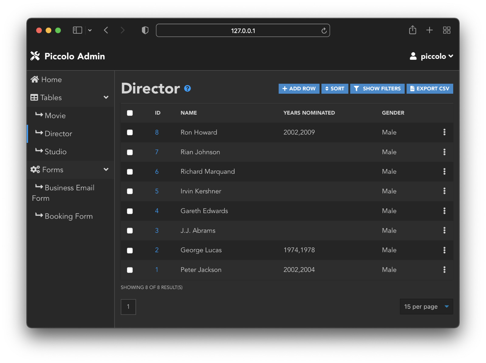
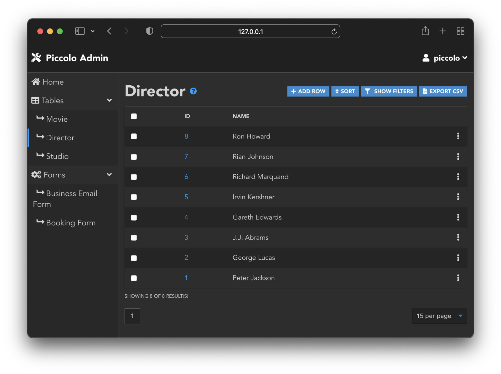

TableConfig
===========

When using ``create_admin``, you can pass in normal ``Table`` classes:

.. code-block:: python

    from piccolo_admin.endpoints import create_admin

    create_admin(Director, Movie)

Alternatively, you can pass in ``TableConfig`` instances (or mix and match
them).

By passing in a ``TableConfig`` you have extra control over how the UI behaves
for that table. For example, we can set which columns are visible in the list
view:

.. code-block:: python

    from piccolo_admin.endpoints import TableConfig

    movie_config = TableConfig(Movie, visible_columns=[Movie.id, Movie.name])

    create_admin(Director, movie_config)

Here is the UI when just passing in a ``Table``:

Here is the UI when just passing in a ``TableConfig`` instance instead (less
columns are visible):

This is really useful when you have a ``Table`` with lots of columns.

In the future, ``TableConfig`` will be extended to allow finer grained control
over the UI.

Source
------

.. currentmodule:: piccolo_admin.endpoints

.. autoclass:: TableConfig
