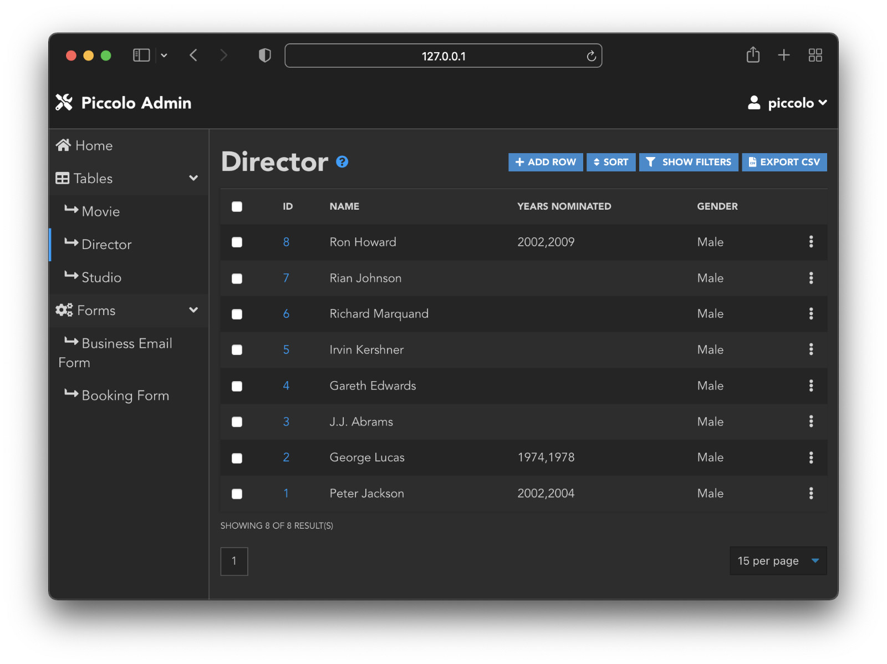
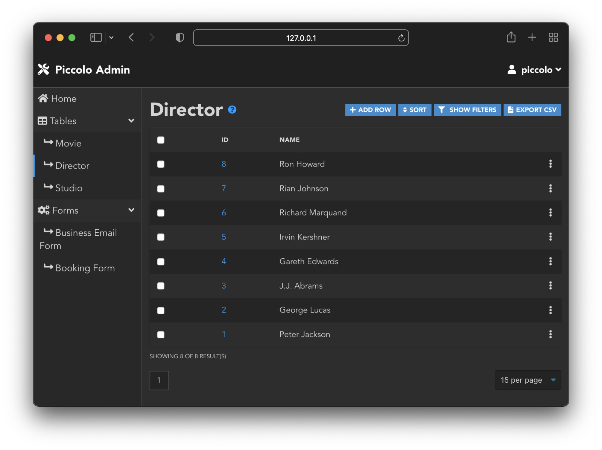
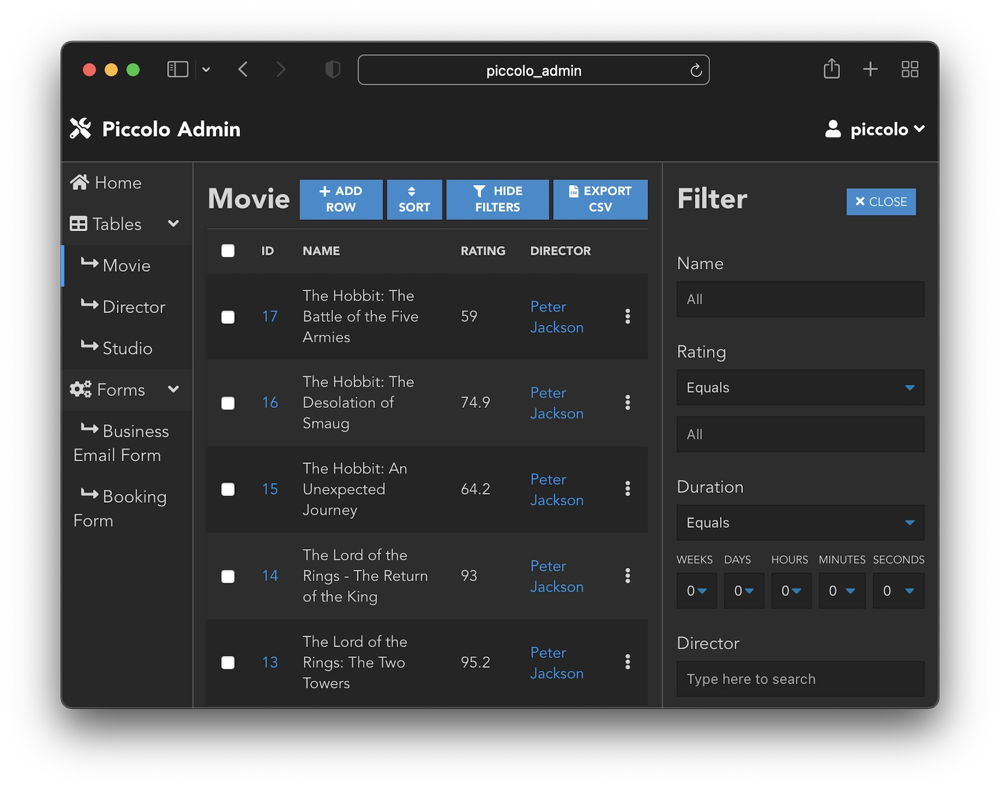
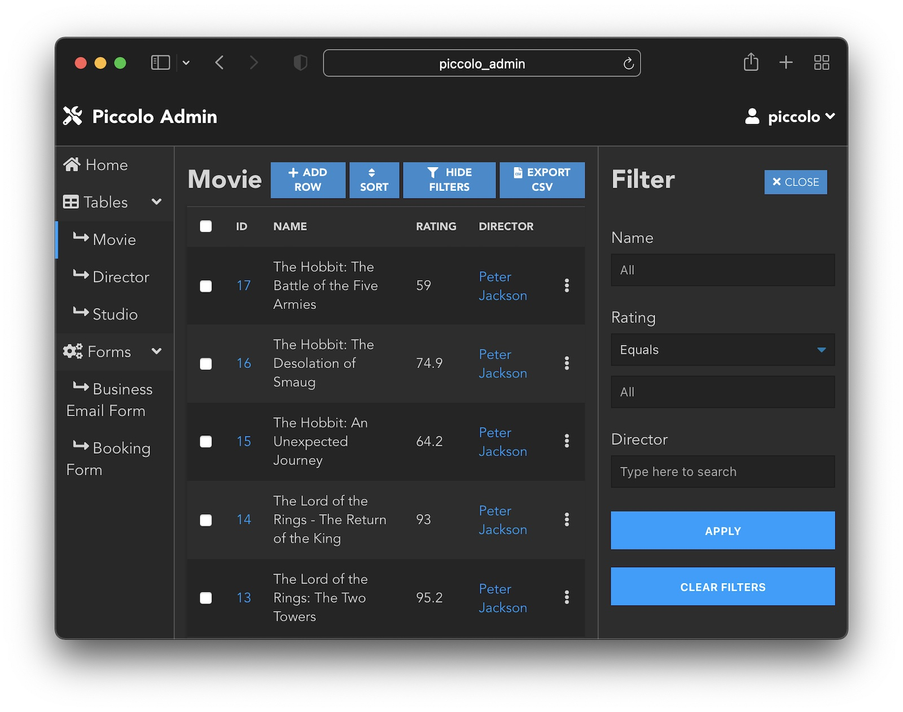
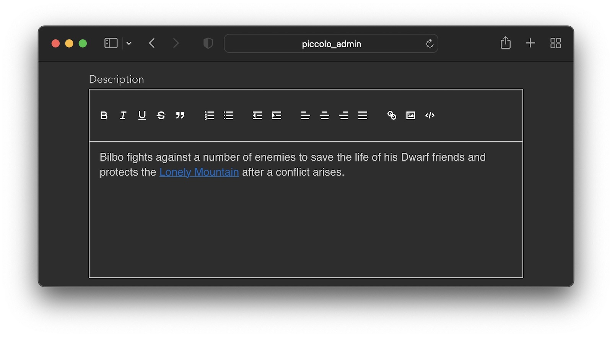

TableConfig
===========

When using ``create_admin``, you can pass in normal ``Table`` classes:

.. code-block:: python

    from piccolo_admin.endpoints import create_admin

    create_admin([Director, Movie])

Alternatively, you can pass in ``TableConfig`` instances (or mix and match
them).

By passing in a ``TableConfig`` you have extra control over how the UI behaves
for that table. This is particularly useful when you have a ``Table`` with lots
of columns.

In the future, ``TableConfig`` will be extended to allow finer grained control
over the UI.

-------------------------------------------------------------------------------

visible_columns
---------------

We can set which columns are visible in the list view:

.. code-block:: python

    from piccolo_admin.endpoints import TableConfig

    movie_config = TableConfig(Movie, visible_columns=[Movie.id, Movie.name])

    create_admin([Director, movie_config])

Here is the UI when just passing in a ``Table``:

Here is the UI when just passing in a ``TableConfig`` instance instead (fewer
columns are visible):

-------------------------------------------------------------------------------

visible_filters
---------------

We can set which columns are visible in the filter sidebar:

.. code-block:: python

    from piccolo_admin.endpoints import TableConfig

    movie_config = TableConfig(
        Movie,
        visible_filters=[
            Movie.name, Movie.rating, Movie.director,
        ]
    )

    create_admin([Director, movie_config])

Here is the UI when just passing in a ``Table``:

Here is the UI when just passing in a ``TableConfig`` instance instead (fewer
filters are visible in the sidebar):

-------------------------------------------------------------------------------

rich_text_columns
-----------------

We can specify which ``Text`` columns will use a rich text editor.

.. code-block:: python

    from piccolo_admin.endpoints import TableConfig

    movie_config = TableConfig(
        Movie,
        rich_text_columns=[
            Movie.description
        ]
    )

    create_admin([Director, movie_config])

This allows the user to add hyperlinks, and basic formatting to their content,
without having to write HTML.

-------------------------------------------------------------------------------

hooks
-----

Can be used to run custom logic when a row is created, modified, or deleted.

.. code-block:: python

    from piccolo_admin.endpoints import TableConfig
    from piccolo_api.crud.hooks import Hook, HookType

    async def my_save_hook(row: Movie):
        # Insert custom logic here
        return row

    movie_config = TableConfig(
        Movie,
        hooks=[
            Hook(hook_type=HookType.pre_save, callable=my_save_hook)
        ]
    )

    create_admin([Director, movie_config])

To learn more about hooks, see the :class:`Hook <piccolo_api.crud.hooks.Hook>`
docs in Piccolo API.

-------------------------------------------------------------------------------

media_storage
-------------

Allows you store files (video / media / audio etc) in certain columns. See
:ref:`MediaStorage`.

-------------------------------------------------------------------------------

validators
----------

Allows fine grained access control over each API endpoint. See
:class:`TableConfig <piccolo_admin.endpoints.TableConfig>` for more
information.

-------------------------------------------------------------------------------

menu_group
----------

We can set groups of tables in the table navigation sidebar. This is useful
when we have many tables and in this way we can organize the tables into
groups for better visibility:

.. code-block:: python

    from piccolo_admin.endpoints import TableConfig

    movie_config = TableConfig(
        Movie,
        menu_group="Movies"
    )

    director_config = TableConfig(
        Director,
        menu_group="Movies"
    )

    create_admin([director_config, movie_config])

-------------------------------------------------------------------------------

link_column
-----------

We use the primary key as the link to the edit page, but we can specify
an alternative column to use as a link. If we specify the foreign key column as
link Piccolo Admin will raise ``ValueError``:

.. code-block:: python

    from piccolo_admin.endpoints import TableConfig

    movie_config = TableConfig(
        Movie,
        link_column=Movie.name
    )

    create_admin([movie_config])

-------------------------------------------------------------------------------

order_by
--------

By default, the primary key is used to order the results, but we can specify
one or more columns to order by instead.

Here we use the ``rating`` column in descending order:

.. code-block:: python

    from piccolo_admin.endpoints import TableConfig, OrderBy

    movie_config = TableConfig(
        Movie,
        order_by=[OrderBy(Movie.rating, ascending=False)]
    )

    create_admin([movie_config])

Here we order by the ``rating`` and ``title`` columns:

.. code-block:: python

    movie_config = TableConfig(
        Movie,
        order_by=[
            OrderBy(Movie.rating, ascending=False),
            OrderBy(Movie.title, ascending=True)
        ]
    )

This means that the results are first ordered by ``rating``, and any rows with
an equal rating are then sorted by ``title``.

Note you can still override the order in the UI.

-------------------------------------------------------------------------------

Source
------

.. currentmodule:: piccolo_admin.endpoints

.. autoclass:: TableConfig
